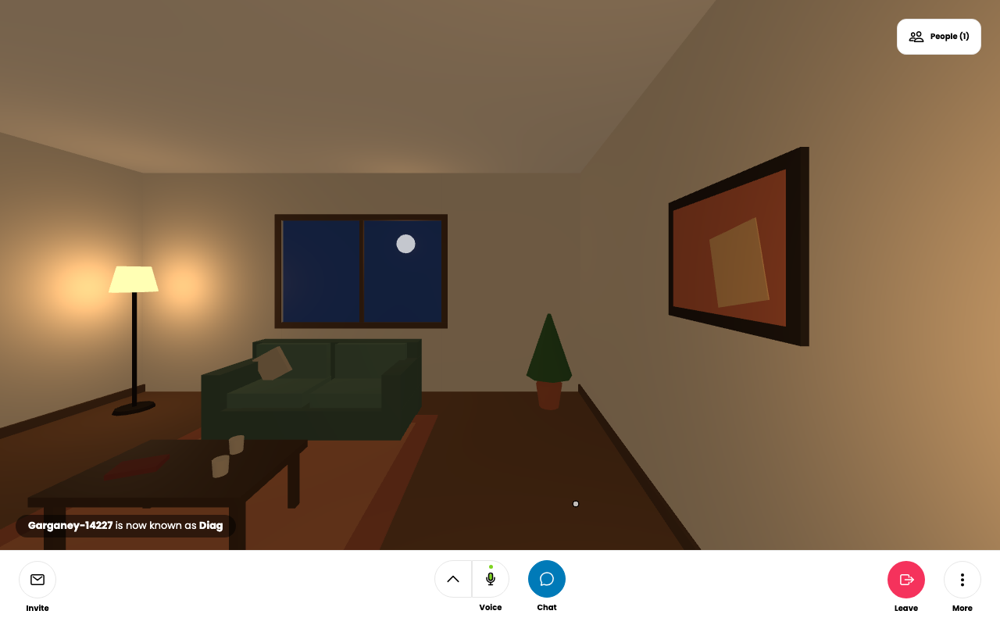

# private-quest-lounge

A private, two-person, browser-based VR lounge for Meta Quest, built on
[Hubs](https://github.com/Hubs-Foundation/hubs) (Hubs Foundation Community
Edition stack). One cosy room, an unguessable invite link, voice chat,
teleport movement, couch seats. No public worlds, no discovery, no uploads,
no strangers.



This repo is a fork of
[hubs-compose](https://github.com/Hubs-Foundation/hubs-compose) (upstream
remote kept as `upstream`), orchestrating forked service checkouts in
`services/` (`hubs` and `reticulum` carry our changes on their `lounge`
branches; `dialog` and `spoke` are stock).

## Local development (macOS/Linux)

Prerequisites: Docker Desktop (or docker + compose plugin), git, and hosts
resolution for the dev names. Mutagen is **not** needed (this fork uses plain
bind mounts).

1. Resolve dev hostnames, either:
   - `sudo sh -c 'printf "127.0.0.1 hubs.local\n127.0.0.1 hubs-proxy.local\n" >> /etc/hosts'`, or
   - (macOS, no sudo) keep an mDNS proxy running:
     `dns-sd -P hubs _https._tcp local 4000 hubs.local 127.0.0.1` (and the same
     for `hubs-proxy.local`).
2. `bin/init` — clones the four service repos on first run, builds images,
   compiles reticulum, runs `npm ci` for dialog/hubs. Takes a while first time.
3. `bin/up` — starts postgres, reticulum, dialog, hubs client and admin.
   (Spoke and Storybook are behind the `extras` compose profile.)
4. Visit https://hubs.local:4000 and accept the self-signed certificate; also
   visit and accept https://hubs.local:8080, https://hubs.local:4443,
   https://hubs.local:8989 once.
5. Sign in: enter an email on the page, then grab the magic link from
   `docker compose logs reticulum` and open it in the same browser.
6. Make yourself admin (first account), then apply the lounge policy:

   ```sh
   docker compose exec reticulum sh -c 'cd /code && mix run -e "
   alias Ret.{Repo, Account}
   Repo.all(Account) |> List.first() |> Ecto.Changeset.change(is_admin: true) |> Repo.update!()"'
   docker compose exec reticulum sh -c "cd /code && mix run priv/repo/lounge_config.exs"
   ```

7. Sign out/in once more (admin claims live in the auth token), click
   **Create Room**, and share the room URL. That URL is the invite.

`bin/down` stops everything.

## What's different from stock Hubs

See `ARCHITECTURE.md` for the full list. Headlines: every room is the bundled
lounge scene with four couch-seat waypoints; avatars come from a fixed set of
six lightweight half-body humans; rooms hold two people; only admins create
rooms; no sign-ups, no media uploads/spawning, no Share/Place/Objects UI, no
favorites, no streamer mode, no scene browsing.

## Deployment path (not yet done — requires spending approval)

The production route is Hubs **Community Edition** (Kubernetes manifests in
[hubs-cloud](https://github.com/Hubs-Foundation/hubs-cloud/tree/master/community-edition)):
a single-node k3s VPS (4 vCPU / 8 GB RAM, ~US$20–40/month), a domain, Let's
Encrypt certificates, and coturn for TURN relay (required for reliable WebRTC
across strict NATs). Reticulum, dialog, postgres and TURN are all persistent
services — there is no serverless shortcut. Quest Browser requires a real
HTTPS certificate (it will not accept the local self-signed setup), so
physical-Quest verification happens after deployment.

## Testing

See `TESTING.md` for the verified test record (two clients, voice, capacity,
failure modes) and the Quest Browser hardware checklist.

## Licences

Upstream Hubs code is MPL-2.0 (notices preserved in each service repo). The
lounge scene and all six avatars are original procedural work generated by
`lounge-assets/generate-lounge.mjs` and `generate-avatars.mjs` — no external
art assets (see `ATTRIBUTION.md`).
